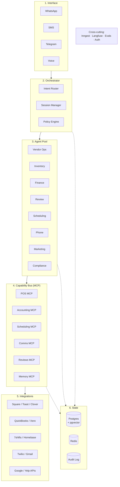

# BlueCairn — Architecture

*Last updated: April 2026 — v0.1*
*Companion to VISION.md and PRODUCT.md. This document is the technical contract with future-us.*

---

## Why this document exists

An architecture document is not a description of what we built. It is a description of **the rules by which we build**.

In two years, we will have written 100,000+ lines of code. Most of it will be forgotten. What must not be forgotten: why we chose Postgres over DynamoDB, why agents never call integrations directly, why multi-tenancy was not optional on day one, why we committed to MCP before the protocol was stable.

This document answers those questions for the person (including future-Vlad) who picks up the codebase cold and asks *why is it shaped this way*. If the answer is not in here, either update this doc or rethink the decision.

Written for engineers who will join the codebase in 2027, 2030, and beyond.

---

## Architectural principles

These are the rules. Every design decision must be traceable to at least one. If a decision violates any of them, it requires an ADR documenting the exception.

### 1. Layers are replaceable in isolation

The system is six layers deep. Each layer has a **stable contract** with the layers above and below it. A given layer can be replaced — a different model provider, a different phone channel, a different queue — without touching any other layer.

If replacing a layer requires changes in multiple other layers, the layer boundary is wrong. Fix the boundary, not the other layers.

### 2. Agents never talk to the outside world directly

An agent's job is to reason. It calls **capabilities**. Capabilities are exposed through MCP servers, never through direct API clients in agent code. This means:
- An agent has no Twilio credentials.
- An agent does not know what email provider we use.
- An agent does not import `squareup-sdk`.

When an agent needs to send a WhatsApp message, check POS sales, or draft an email, it calls a tool on the MCP bus. The bus routes to the right integration. The integration holds the secrets and the vendor-specific code.

This is the single most important architectural rule. Violating it is the fastest path to a codebase that cannot change.

### 3. Durability by default

Any action that has a side effect in the world (sends a message, creates an invoice, updates an external system) is executed through **Inngest**, our durable execution engine. This gives us, for free:
- Retries with exponential backoff.
- Resumability after crashes.
- Step-level visibility in production.
- Timeout and circuit-breaker primitives.
- Observable execution graphs.

In-memory workflows that can be lost on a pod restart are forbidden for anything that touches the real world. Internal reasoning can be in-memory; external effects cannot.

### 4. Multi-tenant from commit #1

Every table has a `tenant_id`. Every query filters by tenant. Every MCP call carries tenant context. Every log line includes tenant identification.

There is no single-tenant prototype phase. There is no "we'll add multi-tenancy later." This decision is irreversible at the data layer, so we make the right one the first time. See `ADR-0006`.

### 5. Prompts are versioned artifacts, not source code

Prompts are stored in the database (or in a dedicated file hierarchy with hash-based identity), versioned, and referenced by ID. No prompt flows into production without passing its eval suite. Changing a prompt is a deployable event, tracked, reversible, measured.

Prompts buried in TypeScript string literals scattered across the codebase are a failure mode. We do not allow them.

### 6. Observability before scale

From day one — not at scale, but at Day 1 — every LLM call, every tool invocation, every agent run, every user interaction is traced in **Langfuse**. We self-host Langfuse for data sovereignty and cost predictability.

The first time we cannot debug a customer issue in production, it is already too late to add observability. We start instrumented.

### 7. Idempotency on the boundary

Every operation that crosses a trust boundary (MCP call, webhook ingress, user command) carries an idempotency key and is safe to replay. Duplicate deliveries are a fact of distributed systems; we build assuming they will happen.

### 8. Human approval is the default, autonomy is earned

The runtime has an explicit **approval state machine**. Every agent action has a policy: `auto`, `approval_required`, or `notify_after`. Policies default to `approval_required` for any new action type. They are promoted to `auto` only by explicit owner opt-in per workflow, after demonstrated reliability.

This is enforced in code, not just in agent prompts. The runtime will not execute an action classified as `approval_required` without an approval token.

### 9. Audit everything an agent touches

Every agent action, tool call, external effect, and human approval is written to an **immutable audit log**. This log is queryable by tenant, by agent, by time range, by action type. It is the foundation of trust with our customers: they can see exactly what was done on their behalf.

Audit log entries are never updated or deleted. Regulatory-grade immutability.

### 10. Fail loud in development, fail soft in production

In development and staging, exceptions halt the system. We want to see them.

In production, exceptions are caught at the runtime boundary, logged with full context, surfaced to ops pod within minutes, and — where possible — replaced with a graceful degradation or a human escalation. The user is never presented with a stack trace.

---

## System overview: the six layers



### Layer 1: Interface

**Purpose:** Receive operator input, deliver operator output. Channel-native, stateless, thin.

**Components:**
- WhatsApp, SMS, Telegram handlers (through Twilio Conversations — one API for all three).
- Voice handler (Vapi for MVP, migration target: self-hosted LiveKit + OpenAI Realtime API when volume justifies).
- Inbound webhook endpoints for channel events.

**Responsibilities:**
- Normalize incoming messages into a canonical `InboundMessage` type.
- Deliver outgoing `OutboundMessage` payloads to the correct channel.
- Handle channel-specific concerns: attachments, read receipts, typing indicators, voice call session lifecycle.
- Enforce per-channel rate limits and spam hygiene.

**Explicitly out of scope at this layer:**
- Understanding what the message means (that's the Orchestrator).
- Deciding how to respond (that's the agent pool).
- Talking to any business system (that's via MCP).

**Contract upward (to Orchestrator):** canonical `InboundMessage` with `{tenant_id, thread_id, channel, sender, content, attachments, timestamp, idempotency_key}`.

---

### Layer 2: Orchestrator

**Purpose:** Route an incoming message to the right agent (or the right set of agents), manage conversation session, enforce tenant-level policies.

**Components:**
- **Intent Router.** Classifies the inbound message and selects a primary agent. Uses a small fast model (Claude Haiku or equivalent) plus a registry of agent capabilities. Can route to multiple agents if the message spans concerns.
- **Session Manager.** Loads conversation context, persists turn-by-turn state, manages handoffs between agents, maintains thread summaries for long conversations.
- **Policy Engine.** Evaluates tenant-specific rules: *"after 11 PM, route only emergency messages to the owner"*, *"vendor disputes above $500 require owner approval"*. Injected into agent runs as policy context.

**Responsibilities:**
- Single entry point from all channels. Agents do not listen to channels directly.
- Graceful multi-agent coordination: if two agents need to collaborate on a request, the orchestrator handles the choreography.
- Back-pressure and load management. If the system is saturated, the orchestrator degrades gracefully.

**Explicitly out of scope:**
- Doing the agent work itself. The orchestrator is thin. If it becomes fat, we split concerns.
- Owning long-running tasks. Those are offloaded to Inngest-managed agent runs.

**Contract upward (to Interface):** `OutboundMessage` back to the correct channel.
**Contract downward (to Agent Pool):** `AgentInvocation` with `{tenant_id, thread_id, agent_id, user_message, thread_context, policy_context, run_id}`.

---

### Layer 3: Agent pool

**Purpose:** Reason about what to do. Produce actions. Never execute external effects directly.

**Components (MVP set of 8):**

| Agent | Priority | Scope |
|---|---|---|
| Vendor Ops (Sofia) | P0 | Delivery reconciliation, vendor disputes, PO management |
| Inventory (Marco) | P0 | Par levels, reorder triggers, waste tracking |
| Finance (Dana) | P0 | Reconciliation, weekly/monthly close, anomaly detection |
| Review (Iris) | P0 | Review monitoring, drafting, posting |
| Scheduling (Leo) | P1 | Shift changes, availability management |
| Phone (Nova) | P1 | Voice triage, reservations, escalations |
| Marketing (Rio) | P2 | Campaign execution, promotion calendar |
| Compliance (Atlas) | P2 | Deadline tracking, inspection prep |

**Structure of an agent:**
- A versioned **prompt** that defines the agent's role, tone, and boundaries.
- A declared set of **tools** it may call (subset of MCP capabilities).
- A declared set of **allowed outcomes** (actions it can produce: send message, create task, draft document, request approval).
- A **policy profile** that defines default approval modes per action.
- An **eval suite** that validates behavior before deployment.

**Responsibilities:**
- Reason about the inbound request given thread context, tenant data (fetched via MCP), and policy.
- Produce a structured `AgentAction` or set of actions. Never execute them.
- Escalate to human ops pod when confidence is low or policy requires.
- Hand off to another agent when out of scope.

**Explicitly out of scope:**
- API calls to external services (through MCP only).
- Direct database writes (through domain services only).
- Inter-agent communication that bypasses the orchestrator.

**Contract downward (to Capability Bus):** MCP tool calls.
**Contract upward (to Orchestrator):** `AgentAction` specifications.

---

### Layer 4: Capability bus (MCP)

**Purpose:** Abstract the outside world into a stable, typed, tool-shaped interface that agents can reason about.

**Architecture:**
- One MCP server per capability domain (POS, Accounting, Scheduling, Comms, Reviews, Memory, etc.).
- Each MCP server is independently deployed, versioned, and replaceable.
- MCP servers expose a **stable capability contract** even when the underlying integration changes. If we switch from Square to Toast, the POS MCP server adapts — agents are untouched.

**The MCP servers we build (MVP):**

| MCP Server | Capabilities exposed | Backing integrations |
|---|---|---|
| POS | `get_sales`, `get_items`, `get_modifiers`, `list_transactions` | Square, Toast, Clover |
| Accounting | `get_ledger`, `create_invoice`, `record_expense`, `get_aging` | QuickBooks, Xero |
| Scheduling | `get_schedule`, `propose_shift_change`, `notify_employee` | 7shifts, Homebase, Sling |
| Comms | `send_message`, `send_email`, `schedule_call` | Twilio, Gmail |
| Reviews | `list_reviews`, `post_response`, `get_metrics` | Google, Yelp, Tripadvisor |
| Memory | `search_memory`, `store_memory`, `get_tenant_profile` | Postgres + pgvector |
| Documents | `generate_pdf`, `extract_receipt`, `parse_invoice` | Internal tooling |

**Why MCP specifically:**
- Standardized protocol (Anthropic-sponsored, broad adoption trajectory).
- Strong type discovery — agents can ask "what can you do" rather than us hard-coding tool lists.
- Natural security boundary — auth and rate limits enforced at the MCP layer.
- Future-proofed — when other vendors ship MCP-native integrations, we drop them in without adapter code.

See `ADR-0003` for the decision record.

**Contract upward (to agents):** typed tool definitions.
**Contract downward (to Integrations):** adapter-mediated vendor calls.

---

### Layer 5: Integrations

**Purpose:** Speak each vendor's native protocol. Isolate vendor-specific concerns.

**Pattern:**
- Each integration is a separate package under `packages/integrations/*`.
- Each integration exposes a **domain-level interface** consumed by its MCP server, not the vendor SDK directly.
- We use unified APIs where they make sense:
  - **Finch** for payroll/HR (covers Gusto, ADP, etc. with one API).
  - **Merge** for accounting (covers QuickBooks, Xero, NetSuite).
  - **Plaid** for banking.
- We use vendor-native SDKs where unified APIs don't exist or don't give us what we need (POS, scheduling, reviews).

**Responsibilities:**
- OAuth flows and credential storage (credentials stored encrypted per-tenant in Postgres; never in agent code or prompts).
- Webhook receivers for vendor events, normalized into internal events.
- Rate limiting and quota management per vendor.
- Retry and fallback behavior.
- Data normalization into internal domain types.

**Explicitly out of scope:**
- Business logic. An integration says "here's what Square reports as sales"; the domain service decides what to do with it.
- Caching or persistence of its own. State lives in the State layer.

---

### Layer 6: State

**Purpose:** Durable truth. Everything we know, everything we've done, everything we can replay.

**Components:**

**Postgres (Neon).** The primary database. Multi-tenant via `tenant_id` on every table, enforced by row-level security (RLS). Schema managed by Drizzle migrations. Includes:
- Domain tables: `tenants`, `users`, `threads`, `messages`, `agent_definitions`, `prompts`, `agent_runs`, `tool_calls`, `actions`, `approval_requests`, `tasks`, `integrations`, `memory_entries`.
- Embeddings via `pgvector` for semantic memory, review clustering, past-operations search.
- Branching for testing and schema changes (Neon-native feature).

**Redis (Upstash).** Hot path and ephemeral state:
- Session context caching.
- Rate limiters (per-tenant, per-channel, per-vendor).
- Idempotency key tracking.
- Short-lived locks for critical sections.

**Audit Log.** Append-only, immutable, queryable:
- Implementation: Postgres table with triggers preventing update/delete.
- Every agent action, tool call, approval decision, external effect.
- Retained indefinitely (regulatory and trust requirement).

**State ownership rule:** the State layer owns data. No other layer persists state locally. Agents do not have "memory files," integrations do not cache, orchestrator does not hold session in RAM. Everything persists to State or dies on next restart.

---

## Cross-cutting concerns

These are not layers; they are concerns that apply across layers.

### Durable execution: Inngest

Every action that touches the outside world is an Inngest function. This gives us retries, step-level checkpointing, observability, and resumability. See `ADR-0004`.

We do not use setTimeout, raw queues, cron jobs, or custom schedulers. All scheduling is Inngest.

### Observability: Langfuse

Every LLM call, MCP tool call, and agent run is traced. Latency, token counts, cost, quality signals — all captured.

Self-hosted on our infrastructure for data sovereignty. We will not send customer conversation data to a third-party tracing SaaS.

### Evals: Braintrust + Promptfoo

No prompt ships without passing its eval suite. Each agent has:
- **Unit evals:** specific input → expected output behaviors.
- **Regression evals:** historical cases that previously broke.
- **Rubric evals:** LLM-as-judge scoring against a written rubric.
- **Adversarial evals:** prompt injection, jailbreak, policy violation cases.

Evals are run in CI. A prompt change with a failing eval does not deploy.

### Authentication and authorization

- **Operator auth:** magic link over their known channel (WhatsApp/SMS/email) for approvals and sensitive actions. No passwords.
- **Internal auth:** Better Auth for ops pod and admin console.
- **Service auth:** mTLS between internal services, API keys with rotation for vendor integrations.
- **Row-level security** in Postgres for multi-tenant isolation, enforced at the database level, not just at the application layer.

### Secrets management

- Vendor OAuth tokens and API keys: encrypted at rest in Postgres, decrypted only in-process when needed, never logged.
- Infrastructure secrets: Vercel environment variables for apps, Doppler or 1Password Secrets Automation for backend services.
- Never in code, never in prompts, never in agent context.

---

## The stack

Every choice is documented here with one-line justification. Full ADRs for the big ones.

### Language and runtime
- **TypeScript strict mode.** One language across apps, workers, and MCP servers. Claude Code is exceptional at TypeScript. Type safety is non-negotiable in an agent-heavy codebase. See `ADR-0001`.
- **Bun.** Speed, TypeScript-native, drop-in Node compatibility. One runtime for dev and production.
- **Hono.** Minimal, fast HTTP framework. Works on Bun, Node, and Cloudflare Workers — optionality for future deployment targets.

### Web framework (ops-web, admin)
- **Next.js 15 (App Router).** React Server Components are the right primitive for data-heavy internal tools.
- **shadcn/ui.** Owned components, consistent design, Tailwind-based.
- **Tailwind v4.**

### Data
- **Postgres (Neon).** Multi-tenant via RLS, pgvector for embeddings, branching for tests. See `ADR-0002`.
- **Drizzle ORM.** Type-safe, code-first migrations, introspectable, works well with AI-assisted development.
- **Upstash Redis.** Serverless Redis for hot path. Per-request pricing, no idle cost.

### AI / LLM
- **Vercel AI SDK.** Provider abstraction. Switch between Claude, GPT, Gemini without rewriting call sites. See `ADR-0005`.
- **Claude Opus 4.7 (or current latest).** Primary model for agent reasoning. Highest quality, worth the cost for customer-facing actions.
- **Claude Haiku (current latest).** Routing, classification, summarization. Cheap and fast.
- **OpenAI Realtime API (GPT-4o).** Voice, through Vapi in MVP, possibly direct when we self-host.
- **Google Gemini.** Long-context jobs (parsing long documents, large multi-source synthesis).

### Agent protocol
- **Model Context Protocol (MCP).** Tool interface between agents and the world. See `ADR-0003`.
- **Anthropic MCP SDK** for server and client implementations.

### Durable execution
- **Inngest.** Durable functions without ops overhead. See `ADR-0004`.

### Observability
- **Langfuse** (self-hosted). LLM-specific tracing, eval integration, prompt versioning.
- **Sentry.** Application exception tracking.
- **Better Stack / Grafana Cloud.** Infrastructure monitoring, logs, alerts.

### Evals
- **Braintrust** for production eval and dataset management.
- **Promptfoo** for local/CI eval runs and prompt iteration.

### Communications
- **Twilio Conversations.** Unified API for WhatsApp, SMS, Telegram.
- **Vapi.** Voice MVP.
- **Resend.** Transactional email (receipts, reports, magic links).

### Auth
- **Better Auth** for internal applications (ops-web, admin).
- **Magic link via owned channels** for operator approvals.

### Infra and deployment
- **Vercel.** Web apps, serverless functions. Edge-deployed where appropriate.
- **Neon.** Serverless Postgres.
- **Inngest Cloud** (managed). Potentially self-host later if volume justifies.
- **GitHub Actions.** CI/CD.

### Monorepo
- **Turborepo** with Bun workspaces. Shared packages, incremental builds, remote caching.

### Layout

```
bluecairn/
├── apps/
│   ├── api/              # Main API (Hono) — channel webhooks, orchestrator entry
│   ├── workers/          # Inngest functions — agent runs, scheduled jobs
│   ├── ops-web/          # Internal console for ops pod (Next.js)
│   └── admin-web/        # Super-admin console for us (Next.js)
├── packages/
│   ├── core/             # Domain types, shared utilities
│   ├── db/               # Drizzle schema, migrations, query helpers
│   ├── agents/           # Agent definitions, prompts, policies
│   ├── mcp-servers/      # One subpackage per MCP server
│   ├── integrations/     # One subpackage per vendor adapter
│   ├── evals/            # Eval suites for each agent
│   └── memory/           # Memory store, embedding helpers
└── docs/
    ├── VISION.md
    ├── PRODUCT.md
    ├── ARCHITECTURE.md
    └── adr/
        └── 00NN-*.md
```

---

## Multi-tenancy

See `ADR-0006` for full reasoning. Summary:

- Every table has `tenant_id uuid not null`.
- Foreign keys within a tenant; nothing crosses tenant boundaries.
- Row-level security enforced at the Postgres layer. Application bugs cannot leak data.
- Every MCP tool call carries tenant context. MCP servers enforce tenant scoping.
- Every Inngest event includes tenant_id. Workers process per-tenant.
- Log lines and traces are tagged with tenant_id for incident response.
- No per-tenant schemas, no per-tenant databases. One schema, strong isolation by convention and by RLS.

We accept the complexity cost of multi-tenancy from day one because retrofitting it is, in our experience, impossible without a rewrite.

---

## Security and compliance posture

We are not HIPAA. We are not PCI. We are a small bootstrapped company doing operational work for restaurants. Posture is proportional.

**Commitments:**
- Encryption at rest (Postgres native, Neon-managed).
- Encryption in transit (TLS everywhere, internal mTLS for service-to-service).
- Principle of least privilege on credentials.
- Audit log for every agent action and human approval.
- No customer data in logs beyond tenant_id and action metadata.
- Incident response playbook by end of Q2 2026.
- SOC 2 Type I by Q4 2027, Type II by Q4 2028 (when we start selling to operators who ask for it).

**Things we explicitly do not promise early:**
- ISO 27001.
- HIPAA (we don't handle PHI).
- PCI DSS (we don't store card data; Stripe / vendor PSPs do).

---

## Evolution rules

How the architecture is allowed to change over time.

### What can change easily
- Model providers and specific models (we abstracted intentionally).
- Individual vendor integrations (the adapter pattern isolates them).
- Individual MCP server implementations (stable contract, swappable internals).
- Frontend frameworks and UI components.
- Hosting providers (with migration effort, but without application rewrite).

### What is expensive to change
- The six-layer shape itself.
- The MCP-as-capability-bus decision.
- The data model's multi-tenancy approach.
- The choice of Postgres as the primary store.
- The choice of TypeScript as the primary language.

Changes to this list require ADRs and a clear-eyed accounting of the migration cost. We will make these changes if they become necessary. We will not make them because they are fashionable.

### What must never change
- The architectural principles at the top of this document.
- The six core values in VISION.md.
- The operator experience of one-thread chat-first interaction.

---

## Anti-patterns (what we do not do)

Written here so we recognize the drift before it happens.

- **Agent code importing vendor SDKs.** Agents use MCP tools. Always.
- **Direct database access from agent code.** Agents read and write through domain services or MCP tools.
- **Prompts as string literals in the codebase.** Prompts are versioned artifacts.
- **In-memory state for anything that has side effects.** Durable execution only.
- **Single-tenant shortcuts "for speed."** We'd rather move slower than rewrite.
- **Custom queue implementations.** Use Inngest.
- **Custom cron implementations.** Use Inngest.
- **Untrace-able LLM calls.** Every call goes through the Vercel AI SDK with Langfuse instrumentation.
- **Prompt changes without evals.** Eval suite is the gate.
- **Multiple admin UIs, dashboards, one-off forms.** The ops pod works from one console. Customers work from chat.
- **Features without measurement.** If we cannot measure its effect on an outcome in VISION.md or PRODUCT.md, we do not ship it.

---

## Cost posture

A quick sketch of the cost structure so we don't fool ourselves about unit economics.

**Per-customer per-month variable cost (at 100-customer scale, rough estimate):**
- LLM inference: $80–140 (Opus-heavy agents with Haiku routing).
- Infrastructure (Neon, Upstash, Vercel, Inngest, Twilio): $40–60.
- Voice (Vapi): $20–40 (call-volume dependent).
- Observability (Langfuse self-hosted amortized): $5–10.
- **Total variable cost: ~$150–250/customer/month.**

At a $2,400/mo price point, this is roughly 88–94% gross margin before ops pod labor. Ops pod is the dominant cost, not infrastructure. This is the correct shape for a managed service business.

**When these numbers change materially:**
- Scale (more customers amortize fixed costs).
- Model pricing (trend is downward).
- Agent efficiency gains from evals and prompt work.

We revisit this section every six months.

---

## Relationship to other documents

- **VISION.md** defines why and who we are.
- **PRODUCT.md** defines what we build for customers.
- **ARCHITECTURE.md** (this doc) defines how we build it.
- **DATA-MODEL.md** defines the concrete schema of Layer 6.
- **AGENTS.md** defines the specific prompts, tools, and policies for each agent in Layer 3.
- **ENGINEERING.md** defines how we write code inside this architecture.
- **DECISIONS/ (ADR/)** contains the full reasoning for architectural choices referenced here.

If this doc contradicts any of the above, this doc is wrong. Fix it.

---

*Drafted by Vlad and Claude (cofounder-architect) in April 2026.*
*Major architectural changes require ADR. This document reflects the current set of ratified ADRs.*
