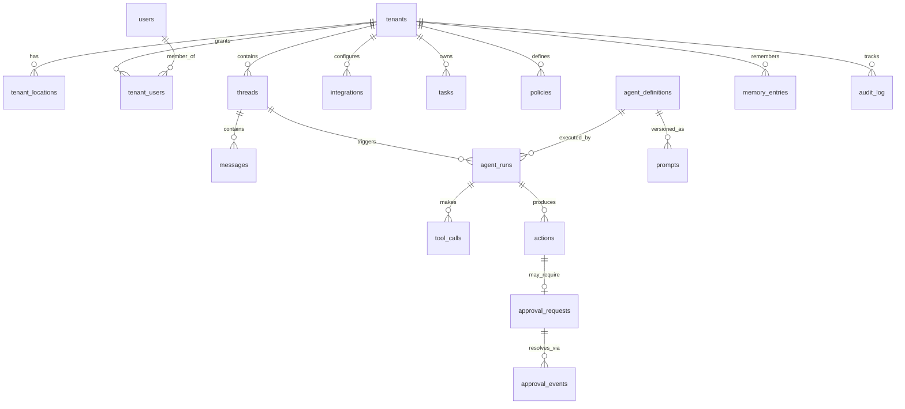

# BlueCairn — Data Model

*Last updated: April 2026 — v0.1*
*Companion to ARCHITECTURE.md. This document defines the shape of Layer 6 (State).*

---

## Why this document exists

The data model is the most expensive thing in the system to change. Code can be rewritten in a weekend; schema migrations across a multi-tenant production database with live customers take weeks and carry real risk.

Everything downstream — agent behavior, analytics, billing, audit — depends on these shapes. Getting them right the first time is cheaper than fixing them later, and some mistakes (missing `tenant_id`, mutable audit log, scalar denormalization we live to regret) are effectively permanent.

This document describes:
1. The principles governing schema design.
2. The core platform tables (stable, high-value, reference-grade).
3. Domain tables (evolving, extensible).
4. How multi-tenancy, audit, and memory are enforced at the database level.

We use **Postgres via Neon**. Schema is managed by **Drizzle** migrations. SQL DDL is the canonical representation in this document — it is implementation-language-agnostic and survives ORM changes.

---

## Design principles

### 1. `tenant_id` on every table, no exceptions

Every row of every table belongs to a tenant. The only exceptions are:
- Platform-global configuration (model registry, feature flags, system-wide settings).
- Our internal ops pod users (who work across tenants but are scoped by role, not tenant).

If a new table is proposed without `tenant_id`, the default answer is no. The person proposing it must justify why this specific entity transcends tenant boundaries.

### 2. UUIDs for primary keys, everywhere

All primary keys are `uuid` (v7 preferred for time-sorted indexes, v4 acceptable). No serial integers, no composite keys masquerading as identity.

Reasoning: multi-tenancy across potential future sharding, safe to expose in URLs, no enumeration attacks, easier merging across environments.

### 3. Money is integer cents

Every monetary field is `bigint` representing cents in USD (or the tenant's currency, tracked separately). No `numeric`, no `float`, no decimal-as-string patterns. One canonical form across the codebase.

Display conversion happens at the edge. Arithmetic always in cents.

### 4. Timestamps are `timestamptz`, always UTC

Every timestamp column is `timestamptz`. Every write is in UTC. Display is localized at the render layer. No `timestamp without time zone` anywhere.

### 5. Soft delete for customer-visible rows, hard delete for transient

- **Customer-visible entities** (threads, messages, tasks, reviews, vendor records) use soft delete via `deleted_at timestamptz`. They can be restored.
- **Transient platform data** (ephemeral sessions, rate limit entries, idempotency tokens) hard-delete on expiration.
- **Audit log entries** are never deleted. Ever. Not even for GDPR — redaction instead.

### 6. Append-only where auditable, mutable where stateful

Any table representing "what happened" is append-only (`agent_runs`, `tool_calls`, `approval_events`, `audit_log`). Any table representing "current state" is mutable with `updated_at` tracking (`tenants`, `threads`, `integrations`).

The distinction matters: append-only gives us time travel and audit; mutable gives us efficient queries. We pay the storage cost for both where meaningful.

### 7. Foreign keys are strict, `on delete` is explicit

Every foreign key declares its behavior: `on delete restrict`, `on delete cascade`, or `on delete set null`. No implicit `restrict` defaults that surprise us later.

Tenant-scoped cascades are common (delete a tenant → cascade to all tenant-scoped rows). Cross-tenant references are disallowed at the schema level.

### 8. Indexes for every read path in the critical workflow

Before a new query enters production, its index is defined. We do not rely on Postgres's query planner to rescue us from missing indexes on hot paths. `EXPLAIN ANALYZE` is part of code review for any new persistent query.

### 9. No `json`/`jsonb` as a dumping ground

`jsonb` is appropriate for genuinely variable payloads (tool call arguments, LLM responses, flexible metadata). It is not appropriate as "I'll figure out the schema later." If we use `jsonb`, we document the expected shape and migrate to typed columns when the shape stabilizes.

### 10. Public-facing slugs, stable IDs

External identifiers (tenant subdomains, public thread IDs for links) are separate from internal UUIDs. Public identifiers are human-readable, changeable; internal UUIDs are stable forever.

---

## Entity overview



This is simplified. Domain tables (vendors, deliveries, inventory, reviews, staff, shifts, sales) hang off `tenants` and reference each other within a tenant's boundary.

---

## Core platform tables

These are the tables the platform itself depends on. They are the most stable and the highest-leverage.

### `tenants`

One row per customer (restaurant business). Multiple physical locations can belong to one tenant.

```sql
create table tenants (
  id                uuid primary key default gen_random_uuid(),
  slug              text not null unique,
  legal_name        text not null,
  display_name      text not null,
  timezone          text not null default 'America/Los_Angeles',
  currency          text not null default 'USD',
  status            text not null default 'active',       -- active | paused | churned
  plan              text not null default 'managed_full', -- managed_full | managed_lite (future)
  onboarded_at      timestamptz,
  churned_at        timestamptz,
  created_at        timestamptz not null default now(),
  updated_at        timestamptz not null default now(),
  deleted_at        timestamptz
);

create index idx_tenants_status on tenants (status) where deleted_at is null;
```

### `tenant_locations`

A tenant may run multiple physical locations. Each has its own POS, staff, and inventory.

```sql
create table tenant_locations (
  id                uuid primary key default gen_random_uuid(),
  tenant_id         uuid not null references tenants(id) on delete cascade,
  name              text not null,
  address           text,
  timezone          text not null,
  pos_integration_id uuid references integrations(id),
  opened_at         date,
  closed_at         date,
  created_at        timestamptz not null default now(),
  updated_at        timestamptz not null default now()
);

create index idx_tenant_locations_tenant on tenant_locations (tenant_id);
```

### `users`

Humans in the system — operators, ops pod members, admins.

```sql
create table users (
  id                uuid primary key default gen_random_uuid(),
  email             text unique,
  phone_e164        text unique,
  display_name      text not null,
  type              text not null,     -- operator | ops_pod | admin
  locale            text default 'en-US',
  created_at        timestamptz not null default now(),
  updated_at        timestamptz not null default now(),
  deleted_at        timestamptz
);
```

Note: users are **not** tenant-scoped. An ops pod member may work across tenants. An operator may own multiple tenants. Access is determined by `tenant_users`.

### `tenant_users`

The many-to-many relationship between users and tenants, with role.

```sql
create table tenant_users (
  id                uuid primary key default gen_random_uuid(),
  tenant_id         uuid not null references tenants(id) on delete cascade,
  user_id           uuid not null references users(id) on delete restrict,
  role              text not null,  -- owner | manager | staff | ops_pod | viewer
  approval_limit_cents bigint,      -- per-action approval cap for this user, null = unlimited
  created_at        timestamptz not null default now(),
  revoked_at        timestamptz,
  unique (tenant_id, user_id)
);

create index idx_tenant_users_tenant on tenant_users (tenant_id) where revoked_at is null;
create index idx_tenant_users_user on tenant_users (user_id) where revoked_at is null;
```

### `channels`

Per-tenant channel configuration (WhatsApp number, SMS number, Telegram bot, voice number).

```sql
create table channels (
  id                uuid primary key default gen_random_uuid(),
  tenant_id         uuid not null references tenants(id) on delete cascade,
  kind              text not null,  -- whatsapp | sms | telegram | voice
  external_id       text not null,  -- twilio SID, telegram chat ID, etc.
  phone_e164        text,
  display_name      text,
  config            jsonb not null default '{}'::jsonb,
  is_primary        boolean not null default false,
  active            boolean not null default true,
  created_at        timestamptz not null default now()
);

create unique index idx_channels_primary_per_tenant
  on channels (tenant_id, kind) where is_primary and active;
```

### `threads`

A conversation between the operator(s) of a tenant and BlueCairn. Typically one primary thread per tenant, but the model allows multiple (e.g., separate threads for staff, for emergencies).

```sql
create table threads (
  id                uuid primary key default gen_random_uuid(),
  tenant_id         uuid not null references tenants(id) on delete cascade,
  channel_id        uuid references channels(id),
  kind              text not null default 'owner_primary',
  title             text,
  summary           text,
  summary_embedding vector(1536),
  last_message_at   timestamptz,
  created_at        timestamptz not null default now(),
  updated_at        timestamptz not null default now(),
  deleted_at        timestamptz
);

create index idx_threads_tenant on threads (tenant_id) where deleted_at is null;
create index idx_threads_last_message on threads (tenant_id, last_message_at desc nulls last);
```

### `messages`

Individual messages in threads. Can be from a user (operator), from an agent, or from the system (internal events rendered as messages).

```sql
create table messages (
  id                uuid primary key default gen_random_uuid(),
  tenant_id         uuid not null references tenants(id) on delete cascade,
  thread_id         uuid not null references threads(id) on delete cascade,
  author_kind       text not null,  -- user | agent | system
  author_user_id    uuid references users(id),
  author_agent_id   uuid references agent_definitions(id),
  content           text not null,
  attachments       jsonb not null default '[]'::jsonb,
  idempotency_key   text,
  external_message_id text,        -- Twilio/Telegram message ID if applicable
  agent_run_id      uuid references agent_runs(id),
  created_at        timestamptz not null default now(),
  delivered_at      timestamptz,
  read_at           timestamptz
);

create index idx_messages_thread_created on messages (thread_id, created_at);
create index idx_messages_tenant_created on messages (tenant_id, created_at);
create unique index idx_messages_idempotency on messages (tenant_id, idempotency_key)
  where idempotency_key is not null;
```

### `agent_definitions`

The registry of agents. One row per agent role. Static data updated via migrations, not by running code.

```sql
create table agent_definitions (
  id                uuid primary key default gen_random_uuid(),
  code              text not null unique,  -- 'vendor_ops', 'inventory', etc.
  persona_name      text not null,          -- 'Sofia', 'Marco', etc.
  display_scope     text not null,          -- 'Vendor Ops', 'Inventory', etc.
  priority          text not null,          -- P0 | P1 | P2
  active_from       timestamptz not null default now(),
  retired_at        timestamptz
);
```

### `prompts`

Versioned prompt artifacts. Referenced by `agent_runs`. Never edited in place — new versions created.

```sql
create table prompts (
  id                uuid primary key default gen_random_uuid(),
  agent_definition_id uuid not null references agent_definitions(id) on delete restrict,
  version           integer not null,
  content           text not null,
  content_hash      text not null,
  eval_passed       boolean not null default false,
  eval_run_url      text,
  created_by        uuid references users(id),
  created_at        timestamptz not null default now(),
  activated_at      timestamptz,
  deactivated_at    timestamptz,
  unique (agent_definition_id, version)
);

create index idx_prompts_active on prompts (agent_definition_id)
  where activated_at is not null and deactivated_at is null;
```

### `agent_runs`

Every invocation of an agent. Append-only. The primary unit of observability.

```sql
create table agent_runs (
  id                uuid primary key default gen_random_uuid(),
  tenant_id         uuid not null references tenants(id) on delete cascade,
  thread_id         uuid references threads(id),
  agent_definition_id uuid not null references agent_definitions(id),
  prompt_id         uuid not null references prompts(id),
  trigger_kind      text not null,          -- user_message | scheduled | webhook | agent_handoff
  trigger_ref       text,                    -- foreign reference for the trigger
  input             jsonb not null,
  output            jsonb,
  status            text not null default 'running', -- running | completed | failed | escalated
  model             text not null,           -- 'claude-opus-4-7', etc.
  input_tokens      integer,
  output_tokens     integer,
  cost_cents        integer,
  latency_ms        integer,
  langfuse_trace_id text,
  started_at        timestamptz not null default now(),
  completed_at      timestamptz
);

create index idx_agent_runs_tenant_time on agent_runs (tenant_id, started_at desc);
create index idx_agent_runs_thread on agent_runs (thread_id, started_at desc);
create index idx_agent_runs_agent_time on agent_runs (agent_definition_id, started_at desc);
create index idx_agent_runs_status on agent_runs (status) where status in ('running', 'escalated');
```

### `tool_calls`

Every MCP tool call made inside an agent run. Append-only.

```sql
create table tool_calls (
  id                uuid primary key default gen_random_uuid(),
  tenant_id         uuid not null references tenants(id) on delete cascade,
  agent_run_id      uuid not null references agent_runs(id) on delete cascade,
  mcp_server        text not null,            -- 'pos', 'accounting', etc.
  tool_name         text not null,
  arguments         jsonb not null,
  result            jsonb,
  error             text,
  status            text not null default 'running',  -- running | success | error
  latency_ms        integer,
  idempotency_key   text,
  started_at        timestamptz not null default now(),
  completed_at      timestamptz
);

create index idx_tool_calls_run on tool_calls (agent_run_id, started_at);
create index idx_tool_calls_tenant_time on tool_calls (tenant_id, started_at desc);
create unique index idx_tool_calls_idempotency on tool_calls (tenant_id, mcp_server, idempotency_key)
  where idempotency_key is not null;
```

### `actions`

What an agent decided to do — a structured output that may require approval, may queue for execution, may emit a message.

```sql
create table actions (
  id                uuid primary key default gen_random_uuid(),
  tenant_id         uuid not null references tenants(id) on delete cascade,
  agent_run_id      uuid not null references agent_runs(id) on delete cascade,
  kind              text not null,            -- send_message | draft_email | create_po | update_schedule | ...
  payload           jsonb not null,
  policy_outcome    text not null,            -- auto | approval_required | notify_after
  status            text not null default 'pending',
                                              -- pending | awaiting_approval | approved | rejected
                                              -- | executing | executed | failed | cancelled
  executed_at       timestamptz,
  failed_at         timestamptz,
  failure_reason    text,
  inngest_event_id  text,
  created_at        timestamptz not null default now(),
  updated_at        timestamptz not null default now()
);

create index idx_actions_tenant_status on actions (tenant_id, status);
create index idx_actions_run on actions (agent_run_id);
create index idx_actions_pending on actions (tenant_id, created_at)
  where status in ('pending', 'awaiting_approval');
```

### `approval_requests`

Actions that require human approval open an approval request.

```sql
create table approval_requests (
  id                uuid primary key default gen_random_uuid(),
  tenant_id         uuid not null references tenants(id) on delete cascade,
  action_id         uuid not null references actions(id) on delete cascade,
  requested_from_user_id uuid references users(id),
  message_id        uuid references messages(id),  -- message that asked for approval
  summary           text not null,
  stakes_cents      bigint,
  expires_at        timestamptz,
  resolved_status   text,                -- approved | rejected | expired | cancelled
  resolved_by_user_id uuid references users(id),
  resolved_at       timestamptz,
  resolution_note   text,
  created_at        timestamptz not null default now()
);

create index idx_approval_pending on approval_requests (tenant_id, created_at)
  where resolved_status is null;
```

### `tasks`

Persistent to-dos and follow-ups. Used for things that span conversations or need reminder logic.

```sql
create table tasks (
  id                uuid primary key default gen_random_uuid(),
  tenant_id         uuid not null references tenants(id) on delete cascade,
  created_by_agent_id uuid references agent_definitions(id),
  assigned_to_user_id uuid references users(id),
  title             text not null,
  description       text,
  due_at            timestamptz,
  priority          text not null default 'normal',  -- low | normal | high | urgent
  status            text not null default 'open',    -- open | in_progress | done | cancelled
  related_action_id uuid references actions(id),
  completed_at      timestamptz,
  created_at        timestamptz not null default now(),
  updated_at        timestamptz not null default now()
);

create index idx_tasks_tenant_status on tasks (tenant_id, status);
create index idx_tasks_due on tasks (tenant_id, due_at) where status = 'open';
```

### `integrations`

Per-tenant connections to external systems.

```sql
create table integrations (
  id                uuid primary key default gen_random_uuid(),
  tenant_id         uuid not null references tenants(id) on delete cascade,
  tenant_location_id uuid references tenant_locations(id),
  provider          text not null,            -- 'square', 'quickbooks', 'toast', etc.
  kind              text not null,            -- 'pos', 'accounting', 'scheduling', etc.
  status            text not null default 'pending',  -- pending | active | expired | revoked
  credentials_encrypted bytea,                 -- encrypted via app-layer KMS
  external_account_id text,
  scopes            text[],
  last_sync_at      timestamptz,
  last_error        text,
  config            jsonb not null default '{}'::jsonb,
  connected_at      timestamptz,
  disconnected_at   timestamptz,
  created_at        timestamptz not null default now(),
  updated_at        timestamptz not null default now()
);

create index idx_integrations_tenant on integrations (tenant_id) where status = 'active';
```

### `policies`

Per-tenant rules that govern agent behavior: approval thresholds, quiet hours, escalation rules.

```sql
create table policies (
  id                uuid primary key default gen_random_uuid(),
  tenant_id         uuid not null references tenants(id) on delete cascade,
  agent_definition_id uuid references agent_definitions(id),  -- null = tenant-wide
  action_kind       text,                                     -- null = all actions of the agent
  rule_key          text not null,                            -- 'auto_approve_under_cents', 'quiet_hours_start', etc.
  rule_value        jsonb not null,
  created_by_user_id uuid references users(id),
  effective_from    timestamptz not null default now(),
  effective_to      timestamptz,
  created_at        timestamptz not null default now()
);

create index idx_policies_lookup on policies (tenant_id, agent_definition_id, action_kind, rule_key)
  where effective_to is null;
```

### `memory_entries`

Semantic memory for a tenant. Used by the Memory MCP server for retrieval.

```sql
create table memory_entries (
  id                uuid primary key default gen_random_uuid(),
  tenant_id         uuid not null references tenants(id) on delete cascade,
  kind              text not null,            -- 'preference' | 'fact' | 'event' | 'pattern'
  content           text not null,
  content_embedding vector(1536),
  source_ref        text,                     -- reference to agent_run, thread, etc.
  importance        smallint not null default 5,  -- 1-10
  created_at        timestamptz not null default now(),
  archived_at       timestamptz
);

create index idx_memory_tenant_kind on memory_entries (tenant_id, kind) where archived_at is null;
create index idx_memory_embedding on memory_entries
  using hnsw (content_embedding vector_cosine_ops);
```

### `audit_log`

Immutable trail. Every platform event that has compliance or trust significance.

```sql
create table audit_log (
  id                uuid primary key default gen_random_uuid(),
  tenant_id         uuid,                    -- nullable for platform-global events
  user_id           uuid references users(id),
  agent_run_id      uuid references agent_runs(id),
  action_id         uuid references actions(id),
  event_kind        text not null,           -- 'action_executed', 'approval_granted', 'integration_connected', etc.
  event_summary     text not null,
  event_payload     jsonb,
  ip_address        inet,
  user_agent        text,
  occurred_at       timestamptz not null default now()
);

create index idx_audit_tenant_time on audit_log (tenant_id, occurred_at desc);
create index idx_audit_kind_time on audit_log (event_kind, occurred_at desc);

-- Immutability enforced by trigger:
create or replace function prevent_audit_mutation() returns trigger as $$
begin
  raise exception 'audit_log is append-only';
end;
$$ language plpgsql;

create trigger audit_log_no_update before update on audit_log
  for each row execute function prevent_audit_mutation();
create trigger audit_log_no_delete before delete on audit_log
  for each row execute function prevent_audit_mutation();
```

---

## Domain tables (illustrative)

These tables hold the operational data that agents reason over. They evolve faster than the platform core. This document lists them at a summary level; full schemas live in the migration history and in `packages/db/schema/domain.ts`.

### Supplier & procurement
- `vendors` — supplier records (name, contact, payment terms, preferred status).
- `vendor_items` — catalog of items and prices per vendor, versioned over time.
- `purchase_orders` — orders to vendors.
- `deliveries` — received deliveries with reconciliation status.
- `vendor_disputes` — disputes raised, their resolution.

### Inventory
- `inventory_items` — stock-keeping units, pars, re-order points.
- `inventory_movements` — receipts, usage, waste, transfers.
- `inventory_snapshots` — periodic counts.

### Finance
- `ledger_accounts` — mapped to accounting system chart of accounts.
- `expenses` — captured expenses with vendor links.
- `anomalies` — agent-detected financial anomalies.

### Reviews & reputation
- `reviews` — ingested from Google/Yelp/Tripadvisor.
- `review_responses` — our drafted and posted replies.

### Workforce
- `staff` — employees (name, role, contact, active status).
- `shifts` — scheduled shifts.
- `shift_changes` — requested changes and their resolutions.

### Sales
- `sales_snapshots` — aggregated daily sales per location per channel.
- `menu_items` — canonical menu (integrated with POS).

### Compliance
- `compliance_items` — deadlines and their state.

All domain tables follow the same principles: `tenant_id not null`, `uuid` PKs, timestamps, money-as-cents. Foreign keys within the tenant's graph.

---

## Multi-tenancy enforcement

Multi-tenant isolation lives at three layers. Each is redundant with the others — we want depth of defense.

### 1. Application layer

Every query issued by the application includes an explicit `tenant_id` filter. The database access layer (Drizzle queries wrapped by our domain services) requires a tenant context object on every call. A missing tenant context is a runtime error, not a silent default.

### 2. Row-level security (RLS)

Every tenant-scoped table has RLS enabled. Sessions set `set local app.current_tenant = '<uuid>'` at the start of each request. Policies enforce:

```sql
alter table threads enable row level security;

create policy threads_tenant_isolation on threads
  using (tenant_id = current_setting('app.current_tenant')::uuid);
```

If a query ever forgets the `tenant_id` filter, RLS silently returns zero rows. The query runs; no data leaks. We detect and alert on abnormal zero-result query patterns.

### 3. Connection role

Application connects as a role with the `bypassrls` privilege disabled. Migrations and admin connect as a separate privileged role with audit logging on every session.

### Ops pod exception

Ops pod members work across tenants. Their sessions set `app.current_tenant` per request to the tenant they are actively serving. Cross-tenant aggregate queries (for reporting, billing) run through a separate service account with explicit role elevation and full audit trail.

---

## Audit log mechanics

The audit log is the trust foundation.

**What is logged:**
- Every agent action that executes.
- Every approval granted or rejected.
- Every integration connected, disconnected, or re-authorized.
- Every user login and session creation.
- Every policy change.
- Every data export or admin override.

**What is NOT logged here (goes to Langfuse traces instead):**
- LLM call internals (prompts, responses) — these are traced operationally, not auditable in the customer-facing sense.
- Individual tool call details — covered by `tool_calls` table.

**Retention:**
- Indefinite for all entries.
- GDPR right-to-be-forgotten: redaction, not deletion. User-identifying fields replaced with tombstone values; event records remain.

**Access:**
- Read-only API exposed to operators via ops console.
- Ops pod can search by tenant, time, kind.
- We ourselves (admin) see everything, with our queries logged.

---

## pgvector strategy

We use `pgvector` as our vector store. No separate vector database.

**Why pgvector, not Pinecone / Weaviate / Qdrant:**
- One system to operate (Postgres) for a solo founder.
- Strong enough at our scale (millions of vectors per tenant, not billions).
- Native SQL joins between vectors and structured data (the key win for an agent system).
- HNSW index performance is competitive for our workloads.

**Embeddings:**
- Model: OpenAI `text-embedding-3-small` (1536 dim). Cheap, good quality, widely supported.
- Cost-tracked per tenant; embedding generation is an explicit operation, not invisible.

**Collections:**
- `memory_entries` — long-term facts, preferences, patterns.
- Future: review clustering, vendor intent classification, menu item similarity.

**When we'd reconsider:**
- 100M+ vectors across the tenant base.
- Sub-millisecond recall requirements.
- Specialized needs (hybrid search at scale, graph retrieval).

At our horizon, pgvector is the right answer for at least 3–5 years.

---

## Migration discipline

### Principles
- Every schema change is a Drizzle migration, generated from the TypeScript schema, reviewed, and committed.
- Migrations are additive by default: add columns, add tables, add indexes. Destructive operations (drop columns, rename, change types) require two-phase deployment with deprecation period.
- Migrations are tested on a Neon branch cloned from production before merging.
- Down-migrations are written where feasible but are not trusted — forward-only recovery is the assumption.

### Two-phase pattern for breaking changes
1. **Phase 1:** Add new column / table. Application writes to both old and new. Backfill. Deploy.
2. **Phase 2:** Application reads from new only. Remove old column / table. Deploy.

This pattern is mandatory for any change that would break a rollback.

### Testing migrations
- Neon branches make this cheap: clone production, apply migration, run test suite, destroy branch.
- Every migration must have a corresponding test that validates pre- and post-state on a representative dataset.

---

## Data retention and lifecycle

| Data | Retention | Rationale |
|---|---|---|
| `messages` | Indefinite | Customer-owned, conversation history |
| `agent_runs`, `tool_calls` | 2 years hot, archived beyond | Operational debugging horizon |
| `actions`, `approval_requests` | Indefinite | Trust and compliance |
| `audit_log` | Indefinite | Immutable by definition |
| `memory_entries` | Indefinite (active), archive after 2 years | Long-term context |
| Domain tables (vendors, deliveries, etc.) | Indefinite | Business records |
| Ephemeral (Redis sessions, idempotency keys) | 24–72 hours | Expiry-driven |

Archive tier (Postgres partitions moved to cold storage or S3) kicks in per-table when we hit scale. Not a concern in the first 24 months.

### Customer offboarding
- On churn, data is retained for 90 days (recovery window).
- After 90 days, tenant data is redacted — identifying fields nulled, content summarized for our learning, personal identifiers scrubbed.
- Full export available at any time on request.

---

## Relationship to other documents

- **ARCHITECTURE.md** defines the six layers. This doc is the concrete shape of Layer 6.
- **AGENTS.md** references `agent_definitions`, `prompts`, `policies`.
- **ENGINEERING.md** defines how we write migrations, how we review schema changes, how we test.
- **ADR-0002** documents why Postgres specifically.
- **ADR-0006** documents multi-tenancy approach in detail.

Schema changes that touch the core platform tables must be discussed. Schema changes within domain tables follow normal engineering process.

---

*Drafted by Vlad and Claude (cofounder-architect) in April 2026.*
*The schema definitions here are canonical at v0.1. Migrations are authoritative in production; this document reflects the intent.*
