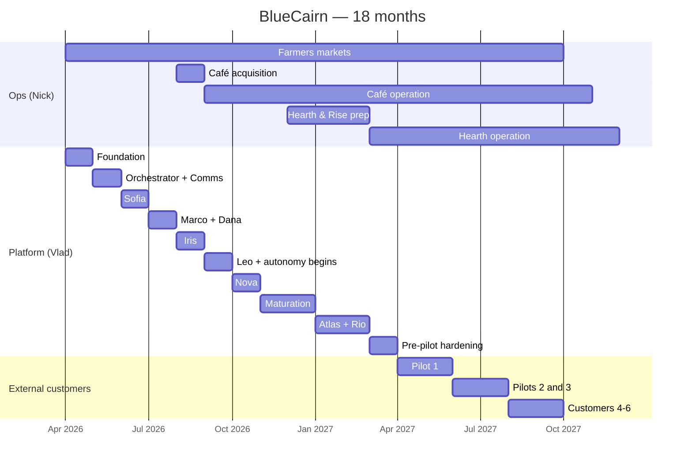

# BlueCairn — Roadmap

*Last updated: April 2026 — v0.1*
*Companion to VISION.md, PRODUCT.md, ARCHITECTURE.md, AGENTS.md.*
*This document plans the first 18 months. Beyond that, we update annually.*

---

## Why this document exists

A roadmap is not a promise. It is a **current best guess** at the sequence of moves that will get us from where we are to where VISION.md says we should be.

We write it down so that:
1. Vlad and Nick know what they are working on this month and why.
2. Future contributors and customers can see the path we walked.
3. When the plan changes — and it will — we can see what we replaced and what it cost.

This document is reviewed monthly. Content expected to be wrong by Month 12 is marked accordingly. Content that must not drift (commitments to customers, ship gates, evaluation thresholds) is marked as fixed.

Written in operator language first, engineer language second.

---

## The three tracks

We run three parallel tracks, deliberately coupled. Decoupling them is a failure mode — each exists because it feeds the others.

### Track A — Operations (Nick)

Nick runs the physical operations that feed the platform with real data, real problems, real customers. The operations are:

- **A1. Farmers markets + wholesale bakery** (Month 0 launch) — commissary-based, light asset, low risk, fast cash generation.
- **A2. Acquired café in Orange County** (Month 4–6 acquisition target) — the primary MVP test bed. Full restaurant operations. Becomes the lab where every agent is trained on real life.
- **A3. Hearth & Rise, second location** (Month 9+) — ground-up brick-and-mortar. Launched only after A2 is stable.

### Track B — Platform (Vlad, with Claude Code)

Vlad builds the platform. This track is disciplined to serve Track A first — we do not build features that no operator is using. Every platform milestone is gated by an operational need that actually exists in Nick's world.

### Track C — External customers (Vlad + ops pod, starting Month 12)

We do not sell to external customers in the first 11 months. Track C exists on the roadmap so we don't forget it's coming, and so platform work in months 1–11 is done with multi-tenancy and ops-pod-friendliness baked in.

First external customer: Month 12 at earliest. Design target: Month 13–14. Three customers by Month 18.

---

## Principles that govern sequencing

These are non-negotiable. They override feature preferences, investor timelines, and founder excitement.

1. **No agent ships without an operational use case driving it.** Sofia does not get built before Nick has actual vendors and actual deliveries. Dana does not get built before there are books to close.

2. **No external customer before internal proof.** A workflow is not ready for an external operator until it has run reliably for us for at least 60 days.

3. **Supervision precedes autonomy.** Every agent starts supervised on every customer. Autonomy is earned per-tenant per-workflow.

4. **We do not chase parallel launches.** Track A1 stabilizes before A2 launches. A2 stabilizes before A3 launches. Each stabilization is data-defined, not vibe-defined.

5. **Platform debt is paid immediately.** If we cut a corner to ship, the ADR for the corner and the repayment plan ship with it.

6. **Revenue-per-hour-of-founder-attention is a metric we track.** A feature that would earn us $500/month but consumes 60 hours of Vlad's time is worse than useless in the first year.

---

## Month-by-month plan

Each month is written with three sections: Track A, Track B, Track C (when relevant), and **Gates** — what must be true to move to the next month.

Phrasing: "Month 1" = first month of active BlueCairn building. Started May 2026 in calendar terms (roadmap begins post-document ratification).

---

### Month 0 — Foundation (April 2026, in progress)

Everything before Month 1. Setup and fixation.

**Track A (Nick):**
- Commissary kitchen selected and contracted (OC area).
- Farmers market permits and booth reservations secured (2–3 markets weekly).
- Initial menu for bakery track locked (5–8 SKUs).
- First wholesale conversations with local coffee shops and small grocers.

**Track B (Vlad):**
- Company documents ratified (this document set).
- Monorepo created, CI/CD scaffolded, Vercel + Neon + Upstash accounts provisioned.
- First migration: core platform tables (`tenants`, `users`, `tenant_users`, `channels`, `threads`, `messages`, `agent_definitions`, `prompts`, `agent_runs`, `tool_calls`, `actions`, `audit_log`).
- Single internal tenant created (`bluecairn-internal`). This is us, the first customer, for infra testing.
- Twilio account provisioned. First WhatsApp sandbox number. First inbound message makes it to the database.

**Gate to Month 1:**
- Nick has a live operational reality (even small) generating at least one signal per day into a chat thread.
- The platform can receive a WhatsApp message and persist it, with tenant isolation verified end-to-end.

---

### Month 1 — First signal, first loop

**Track A:**
- Farmers market launch. First weekend in a market booth. First receipts, first customer interactions, first operational friction log.
- Wholesale: first 1–2 customers taking weekly orders.
- Commissary production rhythm: 3 days/week, scaling as demand confirms.

**Track B:**
- Orchestrator v0.1: receive message, route to a single "catchall" agent that writes everything to a thread visible in a minimal internal web console.
- Internal ops-web (Next.js) at `ops.bluecairn.internal` — read-only view of threads, messages, agent runs.
- First MCP server built: **Comms MCP** (`comms.send_message`, `comms.send_email`).
- First agent stub deployed: generic "Concierge" that responds to Nick's messages with acknowledgment and structured logging. This is not a production agent — it exists to prove the pipeline.
- Langfuse self-hosted, instrumented on every LLM call.

**Gate to Month 2:**
- Every message Nick sends to the BlueCairn WhatsApp number appears in the ops console within 10 seconds.
- Every agent response is logged with latency, tokens, cost.
- Zero cross-tenant leakage in test multi-tenant scenarios (RLS verified with adversarial queries).

---

### Month 2 — Sofia online

**Track A:**
- Farmers markets: routine. 3–4 markets/week, consistent presence. Repeat customers starting to appear.
- Wholesale: 3–5 active accounts.
- **First real vendor relationships**: flour supplier, butter supplier, packaging supplier. This is Sofia's training data.
- Acquired-café search active: first LOIs drafted, accountants engaged, attorney retained.

**Track B:**
- **Sofia (Vendor Ops) agent shipped, supervised mode only**.
- Full **Vendor Ops workflow**: Nick photographs delivery → Sofia reconciles against PO → flags discrepancies → drafts dispute email → Nick approves → email sends → reply tracked.
- MCP servers live: Comms, **Documents** (`parse_invoice`, `extract_receipt`), **Memory** (`search_memory`, `store_memory`).
- Domain tables: `vendors`, `purchase_orders`, `deliveries`, `vendor_disputes`.
- First eval suite: Sofia unit evals (10–15 cases), regression evals (capture first week of real interactions), rubric eval.
- Inngest integration for durable action execution.

**Gate to Month 3:**
- Sofia has reconciled at least 20 real deliveries with 100% of discrepancies caught (audited by Nick).
- Average time from delivery receipt to reconciliation message: <30 min.
- Zero false disputes sent to vendors.

---

### Month 3 — Marco and Dana online

**Track A:**
- Farmers markets: scaling. Adding a 4th market if demand supports it.
- Wholesale: 5–8 accounts. First wholesale account generating >$500/week.
- **Café acquisition**: LOI accepted on one target. Due diligence in progress.
- Commissary inventory has real SKUs, real par levels, real reorder rhythms.

**Track B:**
- **Marco (Inventory) agent shipped, supervised mode**.
- **Dana (Finance) agent shipped, supervised mode**.
- MCP servers live: **POS MCP** (Square initially), **Accounting MCP** (QuickBooks initially).
- Domain tables: `inventory_items`, `inventory_movements`, `ledger_accounts`, `expenses`.
- **Morning briefing** workflow: 6:00 AM message to Nick combining Marco's inventory status and Dana's previous-day finance summary.
- Second eval suite: Marco and Dana, same structure as Sofia.
- First end-to-end flow working: delivery arrives → Sofia reconciles → Marco updates inventory → Dana records expense → morning briefing reflects all of it the next day.

**Gate to Month 4:**
- Three agents running in supervised mode with no critical failures for two consecutive weeks.
- Nick reports measurable time savings (qualitative; hard measurement begins Month 6).
- Platform cost per tenant (instrumented): within $200/month for our one tenant at current volume.

---

### Month 4 — Iris + café acquired

**Track A:**
- **Café acquisition closes** (target). Transition team from previous owner, retention of core staff, rebranding workstream begins.
- Farmers markets continue under Nick's operational oversight with minimal time cost.
- Wholesale: steady state.

**Track B:**
- **Iris (Review) agent shipped, supervised mode**.
- MCP servers live: **Reviews MCP** (Google, Yelp integrations).
- Domain tables: `reviews`, `review_responses`.
- Café onboarding as **second internal tenant** (`cafe-{slug}`). Separate tenant, separate thread, separate data. Multi-tenancy exercised in production for the first time.
- POS migration (from previous owner's system if needed) or integration (if Square/Toast already).
- Historical data backfill: 3 months of POS sales, 6 months of reviews, vendor list.

**Gate to Month 5:**
- Café operating under BlueCairn from Day 1 of new ownership.
- All four P0 agents (Sofia, Marco, Dana, Iris) serving café tenant in supervised mode.
- Nick is primary operator of the café; farmers-market side continues but with reduced hands-on time.

---

### Month 5 — Leo online, autonomy begins

**Track A:**
- Café: stabilization. Team training, menu adjustments, service quality anchor.
- Farmers markets: Nick's presence reduced to 1–2 markets/week, rest handled by staff.
- Wholesale: steady.

**Track B:**
- **Leo (Scheduling) agent shipped, supervised mode**.
- MCP servers live: **Scheduling MCP** (7shifts or Homebase, depending on what café uses).
- Domain tables: `staff`, `shifts`, `shift_changes`.
- **First autonomous promotions**:
  - Sofia: auto-reorder under $200 for established vendors, operator notified after.
  - Marco: auto-record waste under $50.
  - Dana: auto-categorize transactions matching learned patterns with >90% confidence.
  - Iris: auto-respond to 5-star reviews (only) after 15+ operator-confirmed drafts with minimal edits.
- **Approval state machine** refined based on two months of supervised-mode data.

**Gate to Month 6:**
- At least one agent (expected: Sofia) running autonomously on a workflow with zero incidents for 30 days.
- Nick reports time savings >6 hours/week (measured by structured survey).

---

### Month 6 — First measurement, phone online

**Track A:**
- Café: fully stable. Revenue trending to pre-acquisition levels or above.
- Farmers markets: structurally running without Nick's daily attention.
- Wholesale: steady state.
- **Reputation check**: first 60-day café reviews under our ownership reflect the operational discipline.

**Track B:**
- **Nova (Phone) agent shipped, supervised mode**. Vapi-based voice infrastructure.
- MCP servers live: **Voice MCP** (call handling), **Reservations MCP** (if café accepts reservations).
- **Structured measurement survey** run on Nick: hours saved, workflows displaced, shrinkage recovered (attributable dollars).
- **First internal retrospective**: what worked, what didn't, what we'd change about the platform.
- **Documentation pass**: every ADR retrospectively justified or revised. VISION/PRODUCT/ARCHITECTURE updates based on 6 months of lived experience.
- Revenue from ops (farmers markets + café + wholesale): target $40–60K/month gross.

**Gate to Month 7:**
- All five P0/P1 agents (Sofia, Marco, Dana, Iris, Leo) + Nova deployed and stable.
- Measurement survey shows ≥10 hours/week saved, ≥$1,500/month shrinkage recovered (attributable).
- Platform uptime >99.5%.

---

### Month 7–8 — Deepening, not widening

Deliberately conservative months. No new agents. No new features unless they close a gap Nick is actively hitting. **This is the maturation period**.

**Track A:**
- Café and farmers markets continue. This is when boring is success.
- **Hearth & Rise real-estate search begins**. Lease negotiations, site selection, permits research. This is months of background work; actual build-out begins Month 9–10.

**Track B:**
- **Eval depth**: expand every agent's eval suite to 30–50 cases each. Adversarial evals added.
- **Approval policy evolution**: more workflows move from supervised to autonomous per demonstrated reliability.
- **Memory performance**: tune pgvector indexes, measure retrieval quality, improve memory-store prompts.
- **Langfuse dashboards**: production-grade observability for per-agent success rate, latency, cost, escalation rate.
- **Performance optimization**: orchestrator latency P95 target <800ms for routing decisions.
- **Backup and DR**: Neon branch-based backup procedure formalized. Restore-from-backup drill executed.

**Gate to Month 9:**
- Platform running 2 tenants (café, farmers-markets operation) for 60+ days with no critical incidents.
- Every agent's eval suite >30 cases, passing in CI.
- Nick can take a 7-day vacation and the system runs without him (test executed).

---

### Month 9–10 — Hearth launch + Atlas prep

**Track A:**
- **Hearth & Rise construction phase**: build-out, permits finalized, hiring begins, menu development.
- **Café**: continuing as Nick hands more to GM. Nick's attention split between café maintenance and Hearth launch.
- **Farmers markets**: routine.

**Track B:**
- **Atlas (Compliance) agent shipped, supervised mode**. Compliance tracking begins for both café and upcoming Hearth.
- Domain tables: `compliance_items`.
- Compliance calendar backfilled: all permits, insurances, tax filings, employee certs.
- **Third tenant provisioned**: Hearth & Rise. Multi-tenant confidence compounds.
- **Platform hardening**:
  - Per-tenant resource isolation (rate limits, quota).
  - Ops pod console feature: cross-tenant search (for us only, with audit log).
  - Policy engine extensibility: tenant-specific rule definitions.

**Gate to Month 11:**
- Hearth operational (soft launch Month 10, full launch Month 11).
- Atlas tracking compliance for all three operations.
- Platform serving 3 tenants simultaneously with clean isolation.

---

### Month 11 — Hearth live + pre-pilot hardening

**Track A:**
- Hearth & Rise: full launch. First 30 days, all eyes on stabilization.
- Café and farmers markets: routine.

**Track B:**
- **First external-customer workflow**: onboarding playbook documented. What happens in week 1, week 2, week 3 of a new tenant's life.
- **Ops pod infrastructure**: a real human ops-pod console (not just admin-web). Assigned-task view, per-tenant context panel, action escalation queue.
- **Rio (Marketing) agent built and in internal testing** (not yet deployed to production on any tenant).
- **Pricing and contracts**: MVP service agreement drafted (attorney-reviewed), setup-fee invoice template, monthly-fee billing setup via Stripe.

**Gate to Month 12:**
- Three internal tenants running stable for 60+ days.
- External-customer onboarding playbook battle-tested on one of our own operations as if it were a new customer.
- Legal and billing infrastructure in place.

---

### Month 12 — First external customer (pilot #1)

**Track A:**
- All three operations: routine. Hearth stabilizes.

**Track B:**
- **First external customer acquired** — hand-selected, personally known to Vlad or Nick, ideally an existing operator in OC who has been observing.
- Full onboarding: 8–15 hours of ops-pod time in week 1. White-glove, not self-serve.
- Supervised mode on every agent for this tenant. Full transparency on setup, with weekly check-ins.
- **Pilot terms**: 3-month commitment, normal pricing, heavy support.

**Track C:**
- Ops pod = Vlad + (optionally) one part-time hire. This is the first human beyond the founders touching customer accounts.
- Learning loop: what took longer than expected, what needed different wording, what the prompts failed to anticipate.

**Gate to Month 13:**
- External customer is actively using the system daily.
- No critical incidents in the first 30 days.
- Customer NPS (informal) ≥ 8/10.

---

### Month 13–14 — Pilot #2 and #3

**Track A:**
- Routine. Operations feed platform learning continuously.

**Track B:**
- **Second external customer** (Month 13).
- **Third external customer** (Month 14).
- Each hand-selected. Each onboarded with the same discipline as #1.
- **Improvements informed by pilot #1**: onboarding playbook tightened, agent prompts refined for common patterns observed.
- **Ops pod = Vlad + 1 part-time hire**.
- Measurement survey run on pilot #1 at 90-day mark: hours saved, shrinkage recovered, satisfaction.

**Gate to Month 15:**
- Three external customers active, all on paid plans, all showing measurable value.
- At least one customer at 90 days with validated outcomes.

---

### Month 15–16 — First operational learning, productization

**Track A:**
- Routine. By this point, farmers markets may be de-emphasized in favor of café/Hearth/external customers.

**Track B:**
- **Platform refinements based on 3 external customers**:
  - Self-service onboarding components (not full automation — just reducing ops-pod time per customer).
  - Agent prompt tuning from diverse real-world cases.
  - Evolution-path defaults adjusted per what worked in pilots.
- **Ops pod expansion**: first full-time ops pod hire (target: Eastern Europe cost base, or remote US, depending on availability).
- **Rio (Marketing) deployed to willing tenants** in supervised mode. Previously built in Month 11, now tested in production.

**Gate to Month 17:**
- Three external customers retained.
- Ops pod hire integrated and productive.
- Onboarding time per customer reduced from 15 hours to 8–10 hours.

---

### Month 17–18 — First cohort evaluation, external customer #4–6

**Track A:**
- Routine.

**Track B:**
- **Customers #4, #5, #6 onboarded** (1 per month as the bandwidth supports).
- **First cohort evaluation**: customers #1, #2, #3 at 6+ months. Structured interview, outcome measurement, renewal conversation.
- **Platform 18-month review**: architecture revisit, tech-debt assessment, tool selection review, cost posture check.
- **ROADMAP v0.2**: next 18 months planned, informed by everything learned.

**Gate to Month 19 (beyond this document):**
- 6 paying external customers, retention 100% at 18-month mark.
- Platform structurally ready for 20+ customers without fundamental rework.
- Second ops pod hire if volume supports.
- Operational revenue (Nick's three businesses) covering all founder and early-team compensation.

---

## Summary timeline

---

## Capacity and cadence

**Vlad's capacity assumption:** ~40 productive hours per week on platform. Remaining time on drayage operation, family, community. This is a sustainable pace, not a heroic pace.

**Nick's capacity assumption:** full-time on operations. Month 4–6 acquisition plus café stabilization consumes all attention. Month 9 onward he can attend to Hearth alongside café.

**Claude Code assumption:** Vlad uses Claude Code as primary development environment. Code velocity assumes AI-assisted flow. If this assumption breaks (product changes, Claude Code changes), the roadmap slips and we note it.

**Weekly cadence:**
- Monday: plan the week. Review prior week's eval runs. Triage alerts.
- Tuesday–Thursday: deep work.
- Friday: close the week. Documentation updates. Retrospective.
- Weekend: minimal on-call only.

**Monthly cadence:**
- First Monday: roadmap review, update this document with actuals.
- Mid-month: pilot check-ins (once we have pilots).
- Last Friday: structured retrospective (what worked, what didn't, what changes).

**Quarterly cadence:**
- Founder-retreat equivalent: 1 full day off-screen, reviewing VISION, refreshing envisioned future, aligning.

---

## Known risks and their mitigations

| Risk | Likelihood | Impact | Mitigation |
|---|---|---|---|
| Café acquisition falls through | Medium | High | Parallel pipeline of 3–4 targets. If all fail, extended farmers-market period + revised MVP scope. |
| Nick overwhelmed by café operation | High | High | Conservative Month 4–8 platform scope. Platform does not require Nick's attention to function. |
| Agent reliability worse than expected | Medium | High | Eval-gated rollout. Supervised-mode default. Aggressive escalation triggers. |
| Claude Code velocity assumption wrong | Low | High | Regular retrospective on actual vs. assumed velocity. Slip roadmap, do not cut quality. |
| First external customer bad experience | Medium | High | Hand-select customers personally known. Heavy ops support. No at-scale sales until 3 successful pilots. |
| Runway pressure from personal finances | Low–Medium | High | Drayage operation provides parallel income. Operations begin generating revenue Month 1. No VC needed. |
| Regulatory or legal issue at café | Low | High | Attorney retained pre-close. Comprehensive due diligence. Atlas (Compliance) agent active from Month 4 of ownership. |
| Key vendor (Twilio, Vercel, Neon) outage | Low | Medium | Layered architecture allows replacement within 90 days per stability principle. Monitoring and SLAs tracked. |
| Platform complexity outpaces one-person-ops | Medium | Medium | Documented architecture. ADRs. Ops pod hire Month 15 deliberately timed. |

---

## Anti-roadmap: what we are explicitly NOT doing in the first 18 months

Written here so we don't slip into these by accident.

- **No multi-state expansion.** California only. Orange County primarily.
- **No chain customer outreach.** Chains are outside the segment; we will decline even if approached.
- **No VC fundraising.** No pitch decks, no investor calls beyond informational.
- **No marketing spend beyond minimal.** Pilots are hand-selected from personal network, not acquired via ads.
- **No app development (mobile).** Chat is the product.
- **No customer-facing dashboard.** Ever. Not in this roadmap, not in the next one.
- **No additional verticals** (no drayage integration, no retail, no clinics). BlueCairn is food-only until further notice.
- **No free tier, no trial.** Paid pilots only.
- **No premium/enterprise tier.** One plan.
- **No hiring to the platform team.** Vlad + Claude Code only. Ops pod hire Month 15 is the only planned hire.
- **No product launches to press, PR, hype cycles.** We are building in quiet.

---

## Review process

This document is updated monthly. The update rhythm:

1. **First working day of each month**: review the past month. What shipped, what didn't. Update the past month's entry with actuals in italics at the bottom: *"Actual: Sofia shipped Week 3. Reorder auto-threshold landed at $150 rather than $200 per Nick's request."*

2. **Same day**: look ahead 3 months. Adjust next-month plans based on what we know now.

3. **Quarterly**: review 6 months ahead. Revise if needed.

4. **Annually (December)**: full roadmap refresh. Next 18 months planned from scratch with benefit of hindsight.

All changes land in git. No verbal roadmap updates.

---

## Relationship to other documents

- **VISION.md** defines the 30-year destination. This document plans the first 18 months toward it.
- **PRODUCT.md** defines what the agents do for operators. This roadmap sequences when those workflows ship.
- **AGENTS.md** defines each agent in detail. This roadmap says when each agent goes from spec to code to supervised to autonomous.
- **ARCHITECTURE.md** and **DATA-MODEL.md** define the platform shape that the roadmap builds incrementally.
- **OPERATIONS.md** defines how Nick's work generates the operational reality the platform runs on.

If this roadmap conflicts with any of the above, the deeper documents win. This is the most volatile of the foundational docs; we update it frequently and without drama.

---

*Drafted by Vlad and Claude (cofounder-architect) in April 2026.*
*Next review: first working day of the next month. Put it on the calendar.*
